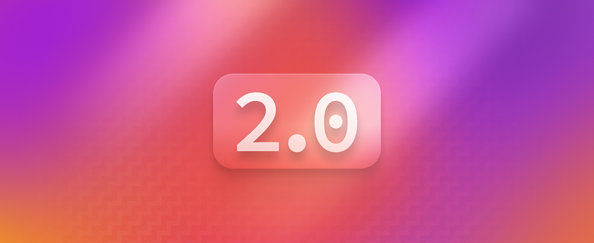

## Introducing Nebulous 2.0!

Astro 3.0 is the first major web framework to support the View Transitions API. Fade, slide, morph, and even persist stateful elements across page navigation with ease. Until recently this had only been possible inside of JavaScript Single Page Applications (SPAs). But thanks to advances in the web platform, these features are now available for everyone in Astro 3.0.

### 🍿 New:
* Image Optimization (stable): Unflagged and better than ever.
* Faster Rendering Performance: Astro components render 30-75% faster.
* SSR Enhancements for Serverless: New ways to connect to your hosting platform.
* HMR Enhancements for JSX: Fast Refresh support for React and Preact.
* Optimized Build Output: Cleaner and more performant HTML.